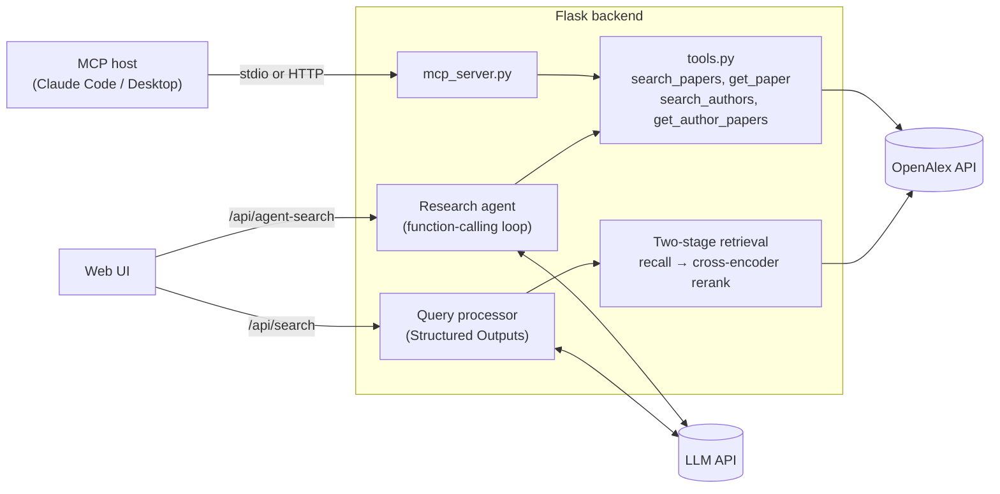

# LitFinder

**English** | [简体中文](README.zh-CN.md)

LitFinder is an LLM-powered academic literature search system. Describe what you are looking for in plain language, for example *"methods for detecting hallucinations in LLM outputs, especially retrieval-based ones"*, and it finds relevant papers and researchers in [OpenAlex](https://openalex.org), a catalog of 300M+ scholarly works.

It started as my undergraduate dissertation at the University of Edinburgh (School of Informatics) and has since been extended with LLM tool use:

- **Pipeline search**: an LLM turns the query into focused search queries using **Structured Outputs** (a Pydantic schema). Retrieval is two-stage: several OpenAlex searches recall candidates, then a **cross-encoder reranker** orders them by relevance to the request.
- **Evaluation**: a 32-query benchmark with graded relevance labels measures every retrieval variant. The reranked pipeline raises nDCG@10 from 0.55 to 0.89-0.92 over the original design ([results](#retrieval-and-evaluation)).
- **Agent search**: the LLM plans the search itself through **function calling**. It picks from four tools, runs several focused searches in parallel, reads abstracts, and returns a ranked, grounded answer with a reason for each paper.
- **MCP server**: the same tools are published over the **Model Context Protocol**, so Claude Code, Claude Desktop or any MCP host can search the literature directly.
- **Provider-agnostic**: works with OpenAI or any OpenAI-compatible API (e.g. Volcano Engine Ark) through `LLM_BASE_URL` / `LLM_MODEL`.

## Architecture



`tools.py` is the single implementation of the search tools. The agent calls it through function calling, and the MCP server exposes it to external hosts.

## Quick Start

Requires Python 3.12+, an OpenAI (or OpenAI-compatible) API key, and ideally a free [OpenAlex API key](https://openalex.org), which avoids OpenAlex's anonymous rate limit.

```bash
git clone https://github.com/LynnUoE/om-dissertation-implementation.git
cd om-dissertation-implementation
python3 -m venv .venv && source .venv/bin/activate
pip install -r requirements.txt
cp backend/.env.example backend/.env     # then fill in your keys
python backend/api_server.py
```

Open http://localhost:5001 and describe what you're looking for; switch the search box from **Search** to **Agent** to try agent search. Flask serves the frontend as well as the API, so no other server is needed locally.

### Configuration

Set these in `backend/.env`:

| Variable | Default | Purpose |
|---|---|---|
| `OPENAI_API_KEY` | required | LLM API key (used unless `LLM_API_KEY` is set) |
| `LLM_MODEL` | `gpt-4o` | Chat model, or a provider's model/endpoint ID. Must support tool calling and `temperature` |
| `LLM_BASE_URL` | OpenAI | Base URL of an OpenAI-compatible provider, e.g. `https://ark.cn-beijing.volces.com/api/v3` |
| `LLM_API_KEY` | `OPENAI_API_KEY` | Key for the provider at `LLM_BASE_URL` |
| `AGENT_MAX_STEPS` | `6` | Max LLM calls per agent search |
| `RETRIEVAL_STRATEGY` | `multi_query` | `multi_query` (two-stage retrieval) or `single_query` (the original pipeline, kept as a baseline) |
| `RERANKER` | `cross-encoder` | `none`, `embedding[:model]` or `cross-encoder[:Hugging Face model]`; the default model is `cross-encoder/ms-marco-MiniLM-L-6-v2` |
| `RERANK_CITATION_WEIGHT` | `0.1` | Weight of a citation-count prior in the final score |
| `CITATION_EXPANSION` | `false` | Also rerank papers co-cited by the top results (one extra OpenAlex request) |
| `AGENT_RERANK` | `false` | Rerank the agent's `search_papers` results with `RERANKER` |
| `OPENALEX_API_KEY` | none | OpenAlex API key (recommended) |
| `RESEARCHER_EMAIL` | `research@example.com` | Contact email sent to OpenAlex |
| `PORT` | `5001` | API port (macOS AirPlay Receiver occupies 5000) |

## Retrieval and Evaluation

### Two-stage retrieval

The original pipeline joined every term the LLM extracted into one long query (often 50+ words). OpenAlex search matches nearly every term, so such queries returned few results, sometimes none: "speculative decoding for LLM inference" found nothing. Pipeline search now works in two stages (`backend/retrieval.py`):

1. **Recall.** The LLM writes 3-5 focused queries of 2-6 terms. Each runs twice on OpenAlex, in parallel: a full-text search sorted by relevance, and a title/abstract search sorted by citations. The results are merged with reciprocal rank fusion, which gives about 100-200 candidates.
2. **Rerank.** A cross-encoder (`ms-marco-MiniLM-L-6-v2`, 22M parameters, runs locally) reads each candidate's title and abstract together with the user's request. The final score is 90% this relevance score and 10% a log-scaled citation prior.

### Evaluation

`eval/` contains the benchmark, described in [eval/README.md](eval/README.md):

- **Queries:** 32 research requests across ML, biology, medicine, materials, climate and social science.
- **Canonical papers:** 159 foundational papers picked by hand, 4-5 per query.
- **Relevance labels:** 2,867 graded labels from a `gpt-4.1` judge, covering every paper any system returned in its top 20.

Selected systems (full table in [eval/results.md](eval/results.md)):

| System | nDCG@10 | Recall@20 | Canonical R@20 | Median latency |
|---|---|---|---|---|
| Original pipeline (one long query) | 0.550 | 0.149 | 0.006 | 4.5 s |
| Focused queries, no reranker | 0.731 | 0.229 | 0.370 | 5.5 s |
| + MiniLM reranker | 0.924 | 0.364 | 0.234 | 6.1 s |
| **+ MiniLM + 10% citation prior (default)** | **0.893** | **0.343** | **0.391** | **6.1 s** |
| + bge-reranker-v2-m3 (568M) | 0.942 | 0.363 | 0.248 | 18.0 s |
| Agent search (gpt-4o) | 0.625 | 0.104 | 0.250 | 15.0 s |

What the numbers show:

- **Reranking is where the gain is.** Focused queries alone help, but reranking lifts nDCG@10 from 0.55 to 0.92 (p < 0.001, paired randomization test).
- **A small cross-encoder is enough.** MiniLM (22M) scores the same as bge-reranker-v2-m3 (568M, p = 0.27) at a third of the latency. OpenAI embeddings score about the same but cost an API call per search.
- **Topical relevance and foundational papers pull in different directions.** The better a variant matches topics, the more often landmark papers such as DDPM are pushed out by newer papers whose titles match the query more closely. A 10% citation prior raises canonical recall from 0.23 to 0.39 (p = 0.001). nDCG@10 goes from 0.92 to 0.89, a change that is not significant (p = 0.14).
- **Some ideas didn't help, so they are off by default.** Citation expansion (snowballing from the top results' references) made no measurable difference. Reranking the agent's tool results raised its nDCG (0.63 → 0.71, p = 0.03) but cut its canonical recall from 0.25 to 0.15.
- **The agent scores lower on these metrics by design.** It recommends about 5-6 papers after about 2 tool calls, while the metrics reward a full top 10/20. Its strengths are explanations, researchers and multi-part questions, which these metrics don't measure.

Run it with `python eval/run_eval.py`.

## Agent Search (Function Calling)

`POST /api/agent-search` lets the model decide which tools to call, instead of following a fixed pipeline.

1. **Tools as schemas.** Each tool's parameters are a Pydantic model that generates a strict JSON Schema (`additionalProperties: false`; every field required; optional ones nullable). The four tools are `search_papers`, `get_paper`, `search_authors` and `get_author_papers`.
2. **Tool-calling loop.** When the model returns tool calls, the server runs them in parallel. It appends the assistant's `tool_calls` message, then one `role="tool"` message per `tool_call_id`, and calls the model again.
3. **Recoverable errors.** Invalid JSON, schema violations, `from_year > to_year`, malformed IDs, unknown tools and OpenAlex failures are returned to the model as `{"error": "..."}` tool results. The model then corrects its arguments instead of the request failing.
4. **Bounded.** At most `AGENT_MAX_STEPS` LLM calls. The last one is made with `tool_choice="none"`, which forces an answer.
5. **Structured, grounded answer.** The final reply is Structured Output: a summary, ranked papers with reasons, and researchers. Paper or author IDs that no tool returned are dropped and listed in `agent.dropped_ids`.

Example: a real response to *"contrastive learning for molecular representations"* (abridged). The agent searched once, then read two full abstracts with `get_paper` before answering:

```json
{
  "status": "success",
  "summary": "The search ... yielded relevant papers ... Notably, a paper on Molecular Contrastive Learning using graph neural networks and another on SMICLR, a framework for multimodal molecular data ...",
  "results": [
    {
      "title": "Molecular contrastive learning of representations via graph neural networks",
      "journal": "Nature Machine Intelligence",
      "publication_date": "2022-03-03",
      "citations": 885,
      "agent_reason": "... discusses using graph neural networks for molecular representation learning, a direct application of contrastive learning principles in the molecular context.",
      "...": "..."
    }
  ],
  "authors": [],
  "agent": {
    "model": "gpt-4o",
    "steps": 3,
    "trace": [
      {"step": 1, "tool": "search_papers", "result": "10 papers", "duration_ms": 622,
       "arguments": {"query": "contrastive learning molecular representations", "from_year": 2018,
                     "to_year": null, "min_citations": 10, "sort": "relevance", "limit": 10}},
      {"step": 2, "tool": "get_paper", "arguments": {"paper_id": "W4214868967"},
       "result": "Molecular contrastive learning of representations via graph neural networks", "duration_ms": 216},
      {"step": 2, "tool": "get_paper", "arguments": {"paper_id": "W4293821372"},
       "result": "SMICLR: Contrastive Learning on Multiple Molecular Representations for ...", "duration_ms": 191}
    ],
    "usage": {"prompt_tokens": 7544, "completion_tokens": 295, "llm_calls": 3},
    "dropped_ids": []
  }
}
```

The web UI shows the summary, a "Why it's here" note on each result, the recommended researchers, and the tool-call trace with token usage.

## MCP Server

`backend/mcp_server.py` publishes the same tools over MCP, using the official Python SDK. The host's model does the reasoning, so the server needs only the OpenAlex settings from `backend/.env` and no LLM key.

| MCP primitive | Provided |
|---|---|
| Tools | `search_papers`, `get_paper`, `search_authors`, `get_author_papers`, all annotated read-only |
| Prompts | `literature_review(topic)` |

- **Shared definitions.** Tool parameters and descriptions come from the same Pydantic models as the function-calling tools, and a test keeps the two in sync.
- **Errors.** Tool failures return `isError: true` results that the model can read.

**Transports**

```bash
python backend/mcp_server.py                     # stdio: the host launches it as a subprocess
python backend/mcp_server.py --transport http    # Streamable HTTP at http://127.0.0.1:8000/mcp
```

**Claude Code.** The repo's `.mcp.json` registers the server for this project. Open the project in Claude Code, approve `litfinder`, and check it with `claude mcp list`. To make it available in every project:

```bash
claude mcp add litfinder -s user -- /absolute/path/to/.venv/bin/python /absolute/path/to/backend/mcp_server.py
```

**Claude Desktop.** Add the following to `~/Library/Application Support/Claude/claude_desktop_config.json`, using absolute paths, then restart the app:

```json
{
  "mcpServers": {
    "litfinder": {
      "command": "/absolute/path/to/.venv/bin/python",
      "args": ["/absolute/path/to/backend/mcp_server.py"]
    }
  }
}
```

### Function Calling vs MCP

| | Function calling (`/api/agent-search`) | MCP (`mcp_server.py`) |
|---|---|---|
| Who runs the loop | This app: it sends tool schemas, executes calls, feeds results back | The MCP host (e.g. Claude Code) |
| Who chooses the model | This app (`LLM_MODEL`) | The host |
| What this project provides | Tools and the orchestration loop | Tools only, discoverable by any MCP host |
| Transport | In-process | stdio or Streamable HTTP (JSON-RPC 2.0) |

Both call the same `tools.py` code.

## API

| Endpoint | Description |
|---|---|
| `POST /api/search` | Pipeline search from a natural-language query |
| `POST /api/agent-search` | Agent search; `options.max_steps` caps LLM calls (2-10) |
| `POST /api/advanced-search` | Search with explicit research areas, topics and methodologies |
| `POST /api/interdisciplinary-search` | Search across several disciplines |
| `GET /api/publication/{id}` | Publication details and its most-cited references (OpenAlex ID or DOI) |
| `GET /api/publication/{id}/analyze` | LLM reading notes for a publication, from its abstract |
| `POST /api/process-query` | Structured query analysis without searching |
| `GET /api/health_check` | Health and request stats |

Errors return a JSON body with `status: "error"` and a `message`. LLM or OpenAlex failures return `502`, unknown publications `404`, and invalid input `400` or `422`.

## Testing

```bash
pip install -r requirements-dev.txt
pytest
```

The 61 tests run offline in under a second. Fake LLM, OpenAlex and reranker clients stand in for the real services. The tests cover:

- two-stage retrieval: query fusion, duplicate merging, filters, reranking, the citation prior, citation expansion, OpenAlex budget errors
- the evaluation metrics
- tool schemas and argument validation
- the agent loop: `tool_call_id` pairing, parallel calls, invented IDs, forced final step, API errors
- the Structured Outputs fallback
- the MCP server, through the SDK's in-process client

## Project Structure

```
backend/
├── api_server.py          # Flask API
├── agent.py               # Function-calling research agent
├── tools.py               # Search tools: Pydantic schemas + OpenAlex implementations
├── mcp_server.py          # MCP server exposing the tools
├── llm.py                 # LLM client config, Structured Outputs helpers
├── query_processor.py     # Query analysis for pipeline search
├── literature_searcher.py # Pipeline search and publication details
├── retrieval.py           # Two-stage retrieval: recall, rerankers, citation expansion
├── research_analyzer.py   # LLM analysis of publications
├── openalex_client.py     # OpenAlex API client
└── .env.example           # Configuration template
frontend/                  # Static HTML/CSS/JS UI
eval/                      # Retrieval benchmark: queries, labels, runs, results
tests/                     # Offline unit tests
config/nginx.conf          # Example Nginx config for deployment
.mcp.json                  # Registers the MCP server for Claude Code
```

## Deployment

In production, Nginx can serve `frontend/` and proxy `/api/` to Flask. `config/nginx.conf` is an example; set its `root` paths to your checkout. The frontend calls the same-origin path `/api`, so it works unchanged behind the proxy.

## Known Limitations and Roadmap

- **Recall is still bounded by OpenAlex keyword search.** About 40% of the canonical papers never reach the candidate pool, so no reranker can find them. Next step: dense retrieval over paper embeddings (e.g. SPECTER2) as a second recall channel.
- **The benchmark labels come from an LLM.** Spot checks look reasonable and 147 of 159 canonical papers were judged highly relevant, but individual labels can be wrong, and 32 queries is a small set.
- **OpenAlex bills every search.** A pipeline search makes about 10 requests; the free daily budget with an API key covers about 1,000. OpenAlex data also has errors: the LoRA paper is stored under the wrong title, and DDPM has another paper's abstract.
- **Agent reasons are free text.** Paper IDs are grounded, but a reason can still contain small inaccuracies.
- **Non-OpenAI providers.** The JSON-mode fallback is unit-tested but has not yet been run against a non-OpenAI provider.

## Troubleshooting

- **Server won't start on macOS.** Port 5000 is taken by AirPlay Receiver; the default is 5001.
- **Searches fail with "rate-limited".** Add `OPENALEX_API_KEY` to `backend/.env`.
- **"OpenAlex daily request budget exhausted".** The free daily budget is used up; the message says when it resets.
- **The first start is slow.** The server loads the reranker at startup, and the first time it downloads the model (about 90 MB) from Hugging Face.
- **Search returns 502.** The `message` field contains the LLM or OpenAlex error. Common causes are an invalid key (`invalid_api_key`) and exhausted credits (`insufficient_quota`).
- **A reasoning model (o-series, gpt-5) errors on `temperature`.** Use a model that accepts it, e.g. `gpt-4o` or `gpt-4.1`.

## Acknowledgments

- [OpenAlex](https://openalex.org) for the open scholarly catalog
- The [Model Context Protocol](https://modelcontextprotocol.io) Python SDK
