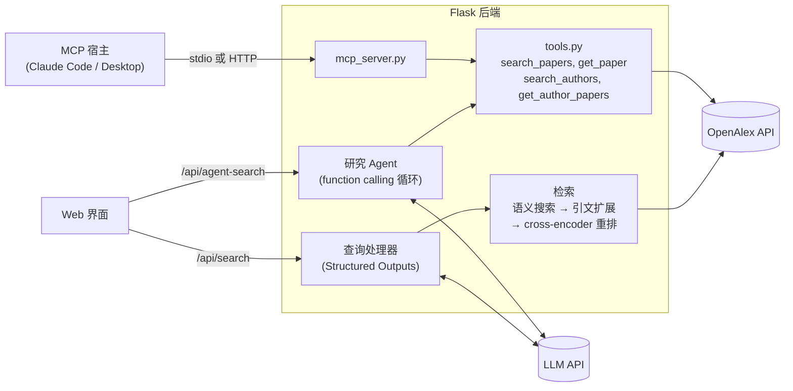

# LitFinder

[English](README.md) | **简体中文**

LitFinder 是一个基于大语言模型的学术文献检索系统。用自然语言描述你要找的内容，比如 *"检测 LLM 输出幻觉的方法，特别是基于检索的方法"*，它会在 [OpenAlex](https://openalex.org)（收录 3 亿多篇学术作品的开放目录）中找到相关论文和研究者。

这个项目最初是我在爱丁堡大学（School of Informatics）的本科毕业设计，之后加入了 LLM 工具调用相关的能力：

- **流水线检索**：OpenAlex **语义搜索**按意思找论文，**引文扩展**补上它们引用的奠基性论文，再用 **cross-encoder reranker** 按与需求的相关度排序。LLM 会先用 **Structured Outputs**（Pydantic schema 约束输出）阅读需求，识别日期范围等限制条件。
- **评测**：一个包含 32 个查询、带分级相关度标签的评测集，用来衡量每一种检索方案。和原始设计相比，现在的方案把 nDCG@10 从 0.55 提高到 0.95，每次检索的 OpenAlex 请求也从 10 次降到 2 次（[结果](#检索与评测)）。
- **Agent 检索**：LLM 通过 **function calling** 自己规划检索过程。它从 4 个工具中选择调用，并行执行多个聚焦的检索，阅读摘要，最后返回排好序、经过 grounding 校验的答案，每篇论文都附有推荐理由。
- **MCP server**：同一套工具通过 **Model Context Protocol** 对外提供，Claude Code、Claude Desktop 或任何 MCP 宿主程序都可以直接用来检索文献。
- **不绑定服务商**：通过 `LLM_BASE_URL` / `LLM_MODEL` 可以使用 OpenAI，或任何兼容 OpenAI 接口的服务（例如火山方舟）。

## 架构



`tools.py` 是检索工具唯一的实现：Agent 通过 function calling 调用它，MCP server 把它提供给外部宿主程序。

## 快速开始

需要 Python 3.12+、一个 OpenAI（或兼容 OpenAI 接口的服务）API key。最好再申请一个免费的 [OpenAlex API key](https://openalex.org)，可以避开 OpenAlex 对匿名请求的限流。

```bash
git clone https://github.com/LynnUoE/om-dissertation-implementation.git
cd om-dissertation-implementation
python3 -m venv .venv && source .venv/bin/activate
pip install -r requirements.txt
cp backend/.env.example backend/.env     # 然后填入你的 key
python backend/api_server.py
```

打开 http://localhost:5001 ，用自然语言描述你要找的内容；把搜索框从 **Search** 切换到 **Agent** 即可体验 Agent 检索。Flask 同时提供前端页面和 API，本地运行不需要其他服务器。

### 配置

在 `backend/.env` 中设置：

| 变量 | 默认值 | 作用 |
|---|---|---|
| `OPENAI_API_KEY` | 必填 | LLM API key（未设置 `LLM_API_KEY` 时使用） |
| `LLM_MODEL` | `gpt-4o` | 对话模型，或服务商的模型 / 接入点 ID。需要支持 tool calling 和 `temperature` 参数 |
| `LLM_BASE_URL` | OpenAI | 兼容 OpenAI 接口的服务商地址，例如 `https://ark.cn-beijing.volces.com/api/v3` |
| `LLM_API_KEY` | `OPENAI_API_KEY` | `LLM_BASE_URL` 对应服务商的 key |
| `AGENT_MAX_STEPS` | `6` | 每次 Agent 检索最多调用 LLM 的次数 |
| `RETRIEVAL_STRATEGY` | `semantic` | `semantic`（语义搜索 + 引文扩展）、`multi_query`（聚焦的关键词检索）或 `single_query`（原始流水线，保留作为基线） |
| `RERANKER` | `cross-encoder` | `none`、`embedding[:模型]` 或 `cross-encoder[:Hugging Face 模型]`；默认模型是 `cross-encoder/ms-marco-MiniLM-L-6-v2` |
| `RERANK_CITATION_WEIGHT` | 按策略 | 最终得分中引用数先验的权重（`semantic` 为 0.2，`multi_query` 为 0.1） |
| `CITATION_EXPANSION` | 按策略 | 把排名靠前的结果共同引用的论文也加入重排（`semantic` 默认开启） |
| `SEMANTIC_RECALL` | `false` | 仅用于 `multi_query`：额外对完整需求做一次语义检索 |
| `AGENT_RERANK` | `false` | 用 `RERANKER` 重排 Agent 的 `search_papers` 结果 |
| `OPENALEX_API_KEY` | 无 | OpenAlex API key（建议设置） |
| `RESEARCHER_EMAIL` | `research@example.com` | 发给 OpenAlex 的联系邮箱 |
| `PORT` | `5001` | API 端口（macOS 的隔空播放接收器占用了 5000） |

## 检索与评测

### 流水线检索如何找到论文

原来的流水线把 LLM 抽取出的所有词拼成一个很长的查询，经常超过 50 个词。OpenAlex 的关键词检索几乎要求每个词都匹配上，所以这种查询返回的结果很少，有时一篇都没有：比如"speculative decoding for LLM inference"就检索不到任何论文。现在的默认流程如下（`RETRIEVAL_STRATEGY=semantic`，代码在 `backend/retrieval.py`）：

1. **语义搜索。** 用户的完整需求交给 OpenAlex 的语义搜索。它在整个 OpenAlex 中按意思匹配标题和摘要，用词不同的论文也能找到。每次最多返回 50 篇，大多是和话题高度吻合的较新论文。
2. **引文扩展。** 奠基性论文很少出现在这些结果里，但这些结果会引用它们。把被多篇高分结果共同引用的论文用一次很便宜的请求取回来，也就是研究者平时手动做的"顺藤摸瓜"。
3. **重排。** 用 cross-encoder（`ms-marco-MiniLM-L-6-v2`，2200 万参数，本地运行）把每篇候选论文的标题和摘要与需求放在一起打分。最终得分由 80% 的相关度分数和 20% 的对数引用数先验组成。

LLM 仍然会先阅读需求，识别"since 2023"之类的限制条件。每次检索只需 2 次 OpenAlex 请求，约 0.0011 美元，每天的免费额度大约可以支持 900 次检索。

之前的关键词方案仍然可以用 `RETRIEVAL_STRATEGY=multi_query` 启用：LLM 写出 3-5 个聚焦检索式，每个检索式分别做一次按相关度排序的全文检索和一次按引用数排序的标题/摘要检索，合并得到约 180 篇候选论文后用同样的方式重排。每次检索需要 10 次请求。

### 评测

`eval/` 目录是评测集，详细说明见 [eval/README.md](eval/README.md)：

- **查询**：32 个研究需求，覆盖机器学习、生物、医学、材料、气候和社会科学。
- **代表作**：手工挑选的 159 篇奠基性论文，每个查询 4-5 篇。
- **相关度标签**：由 `gpt-4.1` 打出的 3,792 条分级标签，覆盖所有系统返回的前 20 篇论文。

部分系统的结果（完整表格见 [eval/results.md](eval/results.md)）：

| 系统 | nDCG@10 | Recall@20 | 代表作 R@20 | 延迟中位数 | OpenAlex 请求数 |
|---|---|---|---|---|---|
| 原始流水线（一个长查询） | 0.550 | 0.098 | 0.006 | 4.5 s | 1 |
| 关键词检索式，不重排 | 0.731 | 0.147 | 0.370 | 5.5 s | 10 |
| 关键词检索式 + MiniLM | 0.924 | 0.232 | 0.234 | 6.1 s | 10 |
| 关键词检索式 + MiniLM + 10% 引用先验（`multi_query`） | 0.893 | 0.218 | 0.391 | 6.1 s | 10 |
| … + 一路语义检索（`SEMANTIC_RECALL=true`） | 0.898 | 0.225 | 0.397 | 6.4 s | 11 |
| 只用语义搜索，按 OpenAlex 的顺序 | 0.950 | 0.251 | 0.106 | 3.9 s | 1 |
| 语义搜索 + MiniLM + 10% 引用先验 | 0.969 | 0.253 | 0.106 | 4.1 s | 1 |
| **语义搜索 + 引文扩展 + MiniLM + 20% 引用先验（默认）** | **0.947** | **0.251** | **0.341** | **4.9 s** | **2** |
| Agent 检索（gpt-4o） | 0.625 | 0.065 | 0.250 | 15.0 s | 约 2-3 |

从数据中可以看出：

- **重排挽救了关键词流水线。** 只用聚焦的关键词检索式也有帮助，但重排把 nDCG@10 从 0.55 提高到 0.92（p < 0.001，配对随机化检验）。
- **语义搜索找话题相关论文的能力超过任何关键词方案。** 单独使用、保持 OpenAlex 返回的顺序，nDCG@10 就有 0.95，而且只需 1 次请求，关键词方案要 10 次。
- **话题相关性和奠基性论文之间存在取舍。** 语义搜索只返回了 159 篇代表作中的 19 篇；方案越贴近话题，DDPM 这样的里程碑论文就越容易被措辞更贴近需求的新论文挤出去。引文扩展加上 20% 的引用先验，把代表作召回率从 0.11 拉回到 0.34。
- **默认方案是最好的平衡。** 和加了语义检索的关键词流水线相比，它的 nDCG@10 更高（0.947 对 0.898，p = 0.02），Recall@20 也更高（p < 0.001），代表作召回率相近（0.34 对 0.40，p = 0.36），快 1.5 秒，OpenAlex 费用只有十分之一。
- **小模型就够用。** MiniLM（2200 万参数）和 bge-reranker-v2-m3（5.68 亿参数）的得分没有显著差异（p = 0.27），延迟却只有后者的三分之一。OpenAI embedding 的得分也差不多，但每次检索要多调用一次 API。
- **不是每个想法都有效。** 引文扩展对关键词流水线没有作用，因为它的候选论文里本来就有经典论文。对 Agent 的工具结果做重排能提高它的 nDCG（0.63 → 0.71，p = 0.03），但它的代表作召回率会从 0.25 降到 0.15，所以默认关闭。
- **Agent 在这些指标上得分较低，这是由它的设计决定的。** 它大约调用 2 次工具，推荐 5-6 篇论文，而这些指标奖励的是完整的前 10 / 前 20 篇结果。Agent 的优势在于推荐理由、推荐研究者、处理多部分问题，这些指标衡量不到。

运行 `python eval/run_eval.py` 可以重跑评测。

## Agent 检索（Function Calling）

`POST /api/agent-search` 不走固定流程，而是让模型自己决定调用哪些工具。

1. **工具即 schema。** 每个工具的参数是一个 Pydantic 模型，自动生成 strict 模式的 JSON Schema（`additionalProperties: false`；所有字段必填，可选字段允许为 null）。4 个工具分别是 `search_papers`、`get_paper`、`search_authors` 和 `get_author_papers`。
2. **Tool calling 循环。** 模型返回 tool call 时，服务端并行执行这些调用。先把 assistant 的 `tool_calls` 消息追加到对话中，再为每个 `tool_call_id` 追加一条 `role="tool"` 消息，然后再次调用模型。
3. **错误可恢复。** 参数不是合法 JSON、不符合 schema、`from_year > to_year`、ID 格式错误、调用了不存在的工具、OpenAlex 出错，这些都会作为 `{"error": "..."}` 工具结果返回给模型。模型会据此修正参数重试，而不是让整个请求失败。
4. **有上限。** 最多调用 `AGENT_MAX_STEPS` 次 LLM，最后一次使用 `tool_choice="none"`，强制模型给出答案。
5. **结构化、经过 grounding 校验的答案。** 最终回复是 Structured Output，包含总结、按相关性排序的论文（附推荐理由）和研究者。任何工具都没有返回过的论文或作者 ID 会被丢弃，并记录在 `agent.dropped_ids` 中。

示例：查询 *"contrastive learning for molecular representations"* 的真实响应（有删节）。Agent 先检索了一次，然后用 `get_paper` 读取了两篇论文的完整摘要，才给出答案：

```json
{
  "status": "success",
  "summary": "The search ... yielded relevant papers ... Notably, a paper on Molecular Contrastive Learning using graph neural networks and another on SMICLR, a framework for multimodal molecular data ...",
  "results": [
    {
      "title": "Molecular contrastive learning of representations via graph neural networks",
      "journal": "Nature Machine Intelligence",
      "publication_date": "2022-03-03",
      "citations": 885,
      "agent_reason": "... discusses using graph neural networks for molecular representation learning, a direct application of contrastive learning principles in the molecular context.",
      "...": "..."
    }
  ],
  "authors": [],
  "agent": {
    "model": "gpt-4o",
    "steps": 3,
    "trace": [
      {"step": 1, "tool": "search_papers", "result": "10 papers", "duration_ms": 622,
       "arguments": {"query": "contrastive learning molecular representations", "from_year": 2018,
                     "to_year": null, "min_citations": 10, "sort": "relevance", "limit": 10}},
      {"step": 2, "tool": "get_paper", "arguments": {"paper_id": "W4214868967"},
       "result": "Molecular contrastive learning of representations via graph neural networks", "duration_ms": 216},
      {"step": 2, "tool": "get_paper", "arguments": {"paper_id": "W4293821372"},
       "result": "SMICLR: Contrastive Learning on Multiple Molecular Representations for ...", "duration_ms": 191}
    ],
    "usage": {"prompt_tokens": 7544, "completion_tokens": 295, "llm_calls": 3},
    "dropped_ids": []
  }
}
```

Web 界面会显示 Agent 的总结、每条结果的"Why it's here"推荐理由、推荐的研究者，以及工具调用记录和 token 用量。

## MCP Server

`backend/mcp_server.py` 使用官方 Python SDK，通过 MCP 对外提供同一套工具。推理由宿主程序的模型完成，所以 server 只需要 `backend/.env` 中的 OpenAlex 配置，不需要 LLM key。

| MCP 能力 | 提供的内容 |
|---|---|
| Tools | `search_papers`、`get_paper`、`search_authors`、`get_author_papers`，全部标注为只读 |
| Prompts | `literature_review(topic)` |

- **定义共享。** 工具的参数和说明与 function calling 使用同一组 Pydantic 模型，并有测试保证两者一致。
- **错误处理。** 工具出错时返回 `isError: true` 的结果，附带模型能看懂的错误信息。

**传输方式**

```bash
python backend/mcp_server.py                     # stdio：由宿主程序作为子进程启动
python backend/mcp_server.py --transport http    # Streamable HTTP，地址为 http://127.0.0.1:8000/mcp
```

**Claude Code。** 仓库中的 `.mcp.json` 为本项目注册了这个 server。在 Claude Code 中打开项目，批准 `litfinder`，然后用 `claude mcp list` 检查连接状态。如果想在所有项目中使用：

```bash
claude mcp add litfinder -s user -- /absolute/path/to/.venv/bin/python /absolute/path/to/backend/mcp_server.py
```

**Claude Desktop。** 在 `~/Library/Application Support/Claude/claude_desktop_config.json` 中加入以下配置（使用绝对路径），然后重启应用：

```json
{
  "mcpServers": {
    "litfinder": {
      "command": "/absolute/path/to/.venv/bin/python",
      "args": ["/absolute/path/to/backend/mcp_server.py"]
    }
  }
}
```

### Function Calling 与 MCP 的区别

| | Function calling（`/api/agent-search`） | MCP（`mcp_server.py`） |
|---|---|---|
| 谁掌控循环 | 本应用：发送工具 schema、执行调用、把结果放回对话 | MCP 宿主程序（例如 Claude Code） |
| 谁选择模型 | 本应用（`LLM_MODEL`） | 宿主程序 |
| 本项目提供什么 | 工具和编排循环 | 只提供工具，任何 MCP 宿主程序都能发现和调用 |
| 传输方式 | 进程内调用 | stdio 或 Streamable HTTP（JSON-RPC 2.0） |

两者调用的是同一份 `tools.py` 代码。

## API

| 接口 | 说明 |
|---|---|
| `POST /api/search` | 基于自然语言查询的流水线检索 |
| `POST /api/agent-search` | Agent 检索；`options.max_steps` 限制 LLM 调用次数（2-10） |
| `POST /api/advanced-search` | 按指定的研究领域、主题和方法检索 |
| `POST /api/interdisciplinary-search` | 跨多个学科的检索 |
| `GET /api/publication/{id}` | 论文详情和它被引最多的参考文献（OpenAlex ID 或 DOI） |
| `GET /api/publication/{id}/analyze` | 根据摘要，用 LLM 生成一篇论文的阅读笔记 |
| `POST /api/process-query` | 只做结构化查询分析，不检索 |
| `GET /api/health_check` | 健康状态和请求统计 |

出错时返回的 JSON 包含 `status: "error"` 和 `message`。LLM 或 OpenAlex 出错返回 `502`，找不到论文返回 `404`，输入不合法返回 `400` 或 `422`。

## 测试

```bash
pip install -r requirements-dev.txt
pytest
```

70 个测试离线运行，不到 1 秒完成，用假的 LLM、OpenAlex 和 reranker 客户端替代真实服务。覆盖范围：

- 检索：语义搜索、关键词检索式融合、重复论文合并、过滤条件、重排、引用先验、引文扩展、各策略的默认配置、OpenAlex 额度用尽和请求超时
- 评测指标
- 工具 schema 和参数校验
- Agent 循环：`tool_call_id` 对应关系、并行调用、编造的 ID、强制最后一步作答、API 出错
- Structured Outputs 的降级逻辑
- MCP server（通过 SDK 的进程内客户端测试）

## 项目结构

```
backend/
├── api_server.py          # Flask API
├── agent.py               # 基于 function calling 的研究 Agent
├── tools.py               # 检索工具：Pydantic schema + OpenAlex 实现
├── mcp_server.py          # 对外提供工具的 MCP server
├── wsgi.py                # gunicorn 的 WSGI 入口（Docker 使用）
├── llm.py                 # LLM 客户端配置、Structured Outputs 辅助函数
├── query_processor.py     # 流水线检索的查询分析
├── literature_searcher.py # 流水线检索、论文详情
├── retrieval.py           # 检索：语义召回和关键词召回、reranker、引文扩展
├── research_analyzer.py   # 用 LLM 分析论文
├── openalex_client.py     # OpenAlex API 客户端
└── .env.example           # 配置模板
frontend/                  # 静态 HTML/CSS/JS 界面
eval/                      # 检索评测集：查询、标签、运行结果、评测结果
tests/                     # 离线单元测试
config/nginx.conf          # 部署用的 Nginx 配置示例
.mcp.json                  # 为 Claude Code 注册 MCP server
Dockerfile, docker-compose.yml
```

## Docker

镜像里包含后端、前端和 reranker 模型，PyTorch 用的是 CPU 版。API key 在运行时从 `backend/.env` 读取，不会被打包进镜像。

```bash
cp backend/.env.example backend/.env           # 然后填入你的 key
docker compose up --build                      # Web 应用：http://localhost:5001
docker compose --profile mcp up --build        # 同时启动 MCP server：http://localhost:8000/mcp
```

Web 应用由 gunicorn 运行（`backend/wsgi.py`）。镜像设置了 `HF_HUB_OFFLINE=1`，启动时不会连接 Hugging Face；如果把 `RERANKER` 换成镜像里没有的模型，需要把它设为 `0`。端口只对本机开放，因为这个应用没有登录功能，而且会消耗你的 API 额度；可以用 `LITFINDER_PORT` 和 `LITFINDER_MCP_PORT` 修改主机端口。

如果要把镜像当作 stdio 方式的 MCP server 使用（比如在 Claude Desktop 里），让宿主程序加上 `-i` 参数运行它：

```json
{
  "mcpServers": {
    "litfinder": {
      "command": "docker",
      "args": ["run", "-i", "--rm", "--env-file", "/absolute/path/to/backend/.env",
               "litfinder", "python", "backend/mcp_server.py"]
    }
  }
}
```

## 部署

不用 Docker 的话，可以用 Nginx 提供 `frontend/` 静态文件，并把 `/api/` 反向代理到 Flask。`config/nginx.conf` 是一份示例配置，需要把其中的 `root` 路径改成你的项目路径。前端通过同源路径 `/api` 调用接口，所以放在反向代理后面无需修改。

## 已知局限和后续计划

- **奠基性论文仍是短板。** 默认方案在前 20 篇里大约能找到三分之一的代表作。语义搜索最多只返回 50 篇，而且 OpenAlex 里摘要登记错误的论文无法被正确排序。下一步：用自建索引扩大候选池，并让 Agent 顺着引用关系追踪论文。
- **评测标签来自 LLM。** 抽查结果看起来合理，159 篇代表作中有 147 篇被判为高度相关，但单条标签仍可能出错，而且 32 个查询的规模偏小。
- **OpenAlex 每次检索都要计费。** 一次流水线检索发 2 个请求（`multi_query` 为 10 个），有 API key 时每天的免费额度约可支持 900 次检索。语义搜索还限制每秒 1 次请求。OpenAlex 的数据本身也有错误：LoRA 论文的标题登记错了，DDPM 的摘要是另一篇论文的。
- **Agent 的推荐理由是自由文本。** 论文 ID 经过 grounding 校验，但推荐理由中仍可能有小错误。
- **非 OpenAI 服务商。** 降级到 JSON mode 的逻辑有单元测试覆盖，但还没有在非 OpenAI 的服务商上实际运行过。

## 常见问题

- **macOS 上服务器启动不了。** 5000 端口被隔空播放接收器占用，默认端口已改为 5001。
- **检索失败，提示 "rate-limited"。** 在 `backend/.env` 中加上 `OPENALEX_API_KEY`。
- **提示 "OpenAlex daily request budget exhausted"。** 当天的免费额度用完了，提示信息里写了多久后重置。
- **第一次启动很慢。** 服务器启动时会加载 reranker 模型，第一次启动需要从 Hugging Face 下载模型（约 90 MB）。
- **检索返回 502。** `message` 字段里是 LLM 或 OpenAlex 的错误信息，常见原因是 key 无效（`invalid_api_key`）或额度用完（`insufficient_quota`）。
- **推理模型（o 系列、gpt-5）报 `temperature` 参数错误。** 换成支持该参数的模型，例如 `gpt-4o` 或 `gpt-4.1`。

## 致谢

- [OpenAlex](https://openalex.org) 提供开放的学术目录
- [Model Context Protocol](https://modelcontextprotocol.io) Python SDK
