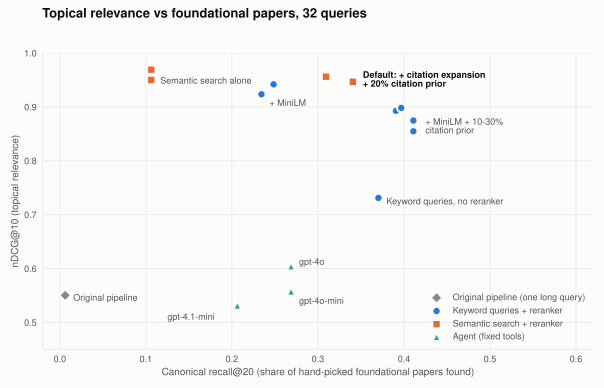
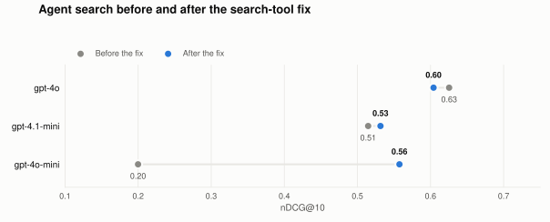

# LitFinder：LLM 文献检索的评测与改进

[English](report.md) | **简体中文**

*技术报告，2026 年 9 月，涵盖 Pull Request #1-#13 的工作。文中所有数字都来自 [`eval/`](../eval/) 中的评测集，可以用 `python eval/run_eval.py --score-only` 从仓库里已提交的运行结果和标签重新计算。*

## 摘要

LitFinder 根据用自然语言描述的研究需求，在 [OpenAlex](https://openalex.org)（收录 3 亿多篇学术作品）中查找论文。本报告衡量了不同检索设计的效果，并说明当前各项默认设置背后的依据。

- **原始流水线经常找不到什么结果。** 它把 LLM 抽取出的所有词拼成一个超过 50 个词的关键词查询，而 OpenAlex 几乎要求每个词都匹配上，所以像"speculative decoding for LLM inference"这样的需求一篇论文都找不到。159 篇手工挑选的奠基性论文，它只找到了 1 篇。
- **重排带来了最大的提升。** 改用简短聚焦的检索式，再加上一个 2200 万参数的 cross-encoder，nDCG@10 从 **0.55 提高到 0.92**（p < 0.001）。这个 cross-encoder 和一个大 25 倍的模型效果相当。
- **话题相关性和奠基性论文之间存在取舍。** 一种设计越贴近话题，越容易把措辞和需求不同的老牌里程碑论文挤出去。少量引用先验加上引文扩展，可以把大部分这类论文找回来。
- **当前默认方案是：OpenAlex 语义搜索 + 引文扩展 + reranker。**
  - nDCG@10 为 **0.947**，优于调好的关键词流水线（p = 0.02）。
  - 奠基性论文的召回率和关键词流水线相近。
  - 每次检索只需 **2 次 OpenAlex 请求，而不是 10 次**；单次检索的费用从约 0.015 美元降到约 0.0014 美元。
- **LLM 负责的事情简单时，便宜模型就够用。** 做查询分析时，gpt-4o-mini 和 gpt-4o 效果一样，费用只有 1/16。
- **测试便宜模型时，发现了 Agent 工具设计上的一个 bug。** 修复后，gpt-4o-mini 版 Agent 的 nDCG@10 从 0.20 提高到 0.56。
- **Agent 的默认模型已改为 gpt-4o-mini。** 两轮运行下来，它和 gpt-4o 的检索质量相当（nDCG@10 0.567 对 0.577，p = 0.62），推荐理由忠于摘要的程度也相同（完全有据 94% 对 95%），费用只有 1/11。三个模型都犯过的一种错误是把论文的结论说反。
- **评测过程还暴露出几个线上 bug。** 两处请求没有设置超时，能让一次检索卡住好几个小时；reranker 在并发调用时会崩溃；OpenAlex 额度用完后，客户端会卡住 5 个小时。

| | nDCG@10 | 代表作 R@20 | 延迟 | 每次检索费用 |
|---|---|---|---|---|
| 原始流水线 | 0.550 | 0.006 | 4.5 s | 约 0.006 美元 |
| **当前默认方案** | **0.949** | **0.347** | **4.7 s** | **约 0.0014 美元** |

## 1. 系统简介

LitFinder 提供三种检索方式：

- **流水线检索**（`POST /api/search`）。LLM 先阅读需求，后端从 OpenAlex 召回候选论文，再由 reranker 排序。本报告优化的就是这条路径。
- **Agent 检索**（`POST /api/agent-search`）。LLM 通过 function calling 自己规划检索过程，可以使用四个工具：`search_papers`、`get_paper`、`search_authors` 和 `get_author_papers`。它返回排好序的论文，每篇附推荐理由，而且只能引用工具实际返回过的 ID。
- **MCP server。** 同样的四个工具通过 Model Context Protocol 提供给 Claude Code、Claude Desktop 等宿主程序。

工作分阶段进行，每个阶段前后都做了测量：

| 阶段 | 改动内容 | PR |
|---|---|---|
| 1 | 本地环境搭建；数据质量修复 | #1, #2 |
| 2 | Agent 检索（function calling）和 Structured Outputs | #3 |
| 3 | MCP server | #4, #5 |
| 4 | 聚焦的关键词检索式 + cross-encoder 重排；建立评测集 | #6 |
| 5 | 前端重做；Docker | #7, #8 |
| 6 | OpenAlex 语义搜索 + 引文扩展成为默认方案 | #9 |
| 7 | 查询分析改用 gpt-4o-mini；修复 Agent 检索工具；LLM 请求超时 | #10, #11 |

## 2. 评测方法

**查询。** 共 32 个用自然语言描述的研究需求（`eval/queries.jsonl`）。大约三分之二是机器学习话题，其余来自生物、医学、材料科学、气候和社会科学。其中一个需求带有日期限制（"published since 2023"）。

**代表作。** 每个查询手工挑选了 4-5 篇奠基性论文，共 159 篇，例如扩散模型的 DDPM、联邦学习的 FedAvg。每篇都在 OpenAlex 中查过，并记录了它的所有副本，因为预印本和正式发表版本往往是分开的两条记录。代表作用来检查系统能否找到经典论文，这项检查不依赖 LLM 裁判。

**相关度标签。** 任何系统返回的前 20 篇论文都会打标（即 TREC 中的 pooling 方法）：

- **裁判：** `gpt-4.1`，温度设为 0，和被测系统使用的不是同一个模型。
- **输入：** 每篇论文的标题和摘要，每次调用只评一个"查询-论文"对。
- **分级：** 2 = 高度相关，1 = 部分相关，0 = 不相关。
- **规模：** 共 3,972 条标签，其中高度相关 2,509 条，部分相关 907 条，不相关 556 条。

**指标：**

- **nDCG@10：** 前 10 篇结果的分级排序质量。
- **Recall@20：** 某个查询的所有高度相关论文中，有多大比例出现在前 20 篇里。分母会随着打标的系统增多而变大，所以只在同一张结果表内比较 Recall@20。
- **代表作 R@20：** 手工挑选的代表作中，有多大比例出现在前 20 篇里。

显著性用 32 个查询上的配对随机化检验计算（10,000 次置换）。

**公平比较。** 只在某一个阶段有差异的系统，其他阶段都共用同一份缓存结果。例如，所有 reranker 变体都对同一份缓存的候选池重排；除非比较的就是 LLM 本身，所有流水线变体对每个查询都共用同一次 LLM 分析。

**检验裁判的可靠性。**

- **代表作：** 159 篇代表作中，裁判把 147 篇判为高度相关，11 篇部分相关，1 篇不相关。
- **更便宜的裁判：** 用更便宜的模型把所有标签重新打一遍，再和 gpt-4.1 的标签对比。

| 裁判 | 完全一致率 | 加权 κ | 系统排名的相关性（Kendall τ，按 nDCG@10） |
|---|---|---|---|
| gpt-4.1-mini | 85% | 0.86 | 0.84 |
| gpt-4.1-nano | 66% | 0.71 | 0.82 |

改用 gpt-4.1-mini，本报告的所有结论都不变，打标费用约为原来的 1/5。gpt-4.1-nano 打分过严：gpt-4.1 判为高度相关的论文中，有 591 篇被它降了级。

## 3. 结果

31 个系统的完整结果表见 [`eval/results.md`](../eval/results.md)。

### 3.1 原始流水线为什么效果差

原始设计让 LLM 抽取研究领域、话题、关键词和扩展词，再把它们全部拼成一个 OpenAlex 查询。OpenAlex 的关键词检索接近"每个词都必须匹配"，所以这种长查询只能匹配到很少的论文，有时一篇都没有。找到的结果再用一个词重叠启发式打分；在人工抽查的查询里，它给几乎所有结果打的分都在 0.94 到 1.00 之间，基本排不出先后。

结果是 nDCG@10 为 0.550，代表作召回率为 0.006。有 5 个查询返回的论文不到 10 篇，其中 1 个一篇都没有。

### 3.2 聚焦检索式与重排

第一次改造让 LLM 写出 3-5 个 2-6 个词的短检索式。每个检索式分别做一次按相关度排序的全文检索和一次按引用数排序的检索，结果（去重后约 180 篇候选论文）用 reciprocal rank fusion 合并，再对照用户的原始需求重排。

| Reranker（候选池相同） | nDCG@10 | 延迟 |
|---|---|---|
| 不重排（只用融合顺序） | 0.731 | 5.5 s |
| OpenAI `text-embedding-3-small` | 0.932 | 6.6 s |
| `ms-marco-MiniLM-L-6-v2` cross-encoder（2200 万参数） | 0.924 | 6.1 s |
| `bge-reranker-base`（2.78 亿参数） | 0.907 | 9.3 s |
| `bge-reranker-v2-m3`（5.68 亿参数） | 0.942 | 18.0 s |

只用聚焦检索式就有提升（0.55 → 0.73），但提升主要来自重排（→ 0.92，p < 0.001）。几个 reranker 之间差距很小：MiniLM 对 bge-v2-m3 的 p = 0.27，对 embedding 的 p = 0.61。MiniLM 在本地运行，不需要调用 API，速度是 bge-v2-m3 的三倍，所以成为默认选择。

### 3.3 取舍：话题相关性与奠基性论文

<picture>
  <source media="(prefers-color-scheme: dark)" srcset="figures/tradeoff-dark.svg">
  
</picture>

在关键词流水线上做的两个实验，都显示出同样的规律。

**1. 按引用数排序的检索只匹配标题和摘要。** 第一版里，按引用数排序的检索匹配的是全文，返回的是只在正文里提到这些词的高被引论文，比如检索扩散模型时出现了 R 语言、AlphaFold。改为只匹配标题和摘要后，Recall@20 提高了（0.207 → 0.226，p = 0.021），代表作召回率却*下降*了（0.347 → 0.234，p = 0.003）。跑题的高被引论文很容易被 reranker 排除；标题和查询高度吻合的新论文却不会，它们把措辞不同的老牌经典论文挤了出去。比如对于"diffusion models for high-quality image generation"，被挤掉的就是 "Denoising Diffusion Probabilistic Models"。

**2. 引用先验。** 在最终得分中加入对数缩放后的引用数：

| 引用先验权重 | nDCG@10 | 代表作 R@20 |
|---|---|---|
| 0 | 0.924 | 0.234 |
| 0.1 | 0.893 | 0.391 |
| 0.2 | 0.875 | 0.411 |
| 0.3 | 0.855 | 0.411 |

权重为 0.1 时，代表作召回率提高了 16 个百分点（p = 0.001），nDCG 的变化不显著（p = 0.14）。超过 0.1 以后，nDCG 继续下降，代表作召回率却不再提高。

**引文扩展在这里没有效果。** 它会补充被多篇排名靠前的候选论文共同引用的文献（nDCG 不变，代表作召回率 p = 0.25），因为关键词候选池里本来就已经有大部分经典论文，reranker 能把它们排上来。

### 3.4 语义搜索

2026 年 2 月，OpenAlex 上线了语义搜索：每篇作品的标题和摘要都被编码成向量（GTE-Large，1,024 维），查询按意思匹配。每次请求最多返回 50 条结果。

| 召回设计（都用 MiniLM 重排） | nDCG@10 | Recall@20 | 代表作 R@20 | OpenAlex 请求数 |
|---|---|---|---|---|
| 关键词检索式 + 10% 先验 | 0.893 | 0.213 | 0.391 | 10 |
| … + 一路语义检索 | 0.898 | 0.220 | 0.397 | 11 |
| 只用语义搜索（OpenAlex 的顺序，不重排） | 0.950 | 0.245 | 0.106 | 1 |
| 语义搜索 + 10% 先验 | 0.969 | 0.247 | 0.106 | 1 |
| 语义搜索 + 引文扩展 + 10% 先验 | 0.956 | 0.245 | 0.309 | 2 |
| **语义搜索 + 引文扩展 + 20% 先验（默认）** | **0.947** | **0.245** | **0.341** | **2** |

语义搜索处在这个取舍的最极端。它是测过的方案里话题相关性最高的：不重排，nDCG@10 就有 0.95。但 159 篇代表作中，只有 19 篇出现在它的结果里。引文扩展正好补上了这个短板：新论文都会引用经典论文，把它们引用最多的论文取回来，代表作召回率就从 0.11 回到 0.31（p < 0.001），加上 20% 的先验后达到 0.34。

和加了语义检索的关键词流水线相比，默认方案在这几方面更好：

- **nDCG@10：** 0.947 对 0.898，p = 0.02。
- **Recall@20：** p < 0.001。
- **延迟：** 快 1.5 秒。
- **成本：** OpenAlex 请求数只有十分之一。

代表作召回率为 0.34 对 0.40，差异不显著（p = 0.36）。

### 3.5 为查询分析选择 LLM

改用语义召回后，LLM 不再需要写检索式，只负责识别日期范围之类的限制条件。

| 查询分析模型 | nDCG@10 | 代表作 R@20 | 每次检索的 LLM 费用 |
|---|---|---|---|
| gpt-4o | 0.947 | 0.341 | 约 0.0046 美元（估算） |
| gpt-4.1-mini | 0.949 | 0.347 | 0.00077 美元 |
| **gpt-4o-mini（默认）** | **0.949** | **0.347** | **0.00028 美元** |

三个模型都正确识别出了"since 2023"，检索结果在误差范围内完全一致（p = 0.50）。因此这一步的默认模型改为 gpt-4o-mini（`QUERY_LLM_MODEL`）。

### 3.6 Agent 检索

Agent 的每一步检索都由 LLM 规划，所以模型的影响要大得多。第一轮用便宜模型运行的结果如下：

| Agent 模型 | nDCG@10 |
|---|---|
| gpt-4o | 0.625 |
| gpt-4.1-mini | 0.515 |
| gpt-4o-mini | 0.200 |

调用记录解释了 gpt-4o-mini 为什么这么差：

- **自行添加过滤条件。** 它加上了用户没有要求的日期和引用数过滤，还按"最新"排序。
- **非相关度排序背后是全文检索。** 工具按日期和引用数排序时检索的是全文，和 §3.3 是同一个陷阱。结果是正文里提到这些词的最新论文，比如检索扩散模型时出现了品牌设计、电池材料的论文。
- **编造推荐理由。** 模型还给这些论文编出了看似合理的推荐理由。

修复分两部分：

- **工具。** 按日期和引用数排序的检索只匹配标题和摘要。
- **提示词。** 禁止添加用户没要求的过滤条件，禁止推荐跑题的论文，推荐理由必须以摘要为依据。

<picture>
  <source media="(prefers-color-scheme: dark)" srcset="figures/agent-fix-dark.svg">
  
</picture>

| Agent 模型（修复后） | nDCG@10 | 代表作 R@20 | 每次检索的 LLM 费用 | 延迟 |
|---|---|---|---|---|
| gpt-4o | 0.604 | 0.269 | 0.027 美元 | 12.2 s |
| gpt-4.1-mini | 0.532 | 0.206 | 0.0050 美元 | 5.6 s |
| gpt-4o-mini（现为默认，见 §3.7） | 0.557 | 0.269 | 0.0021 美元 | 6.3 s |

修复后的结果说明：

- **gpt-4o-mini 恢复了正常。** 它从 0.20 提高到 0.56（p < 0.001），现在和 gpt-4o 的差距在误差范围内（p = 0.085），费用只有 1/13。
- **另外两个模型没有受到影响**，变化在误差范围内（p ≈ 0.5）。
- **gpt-4.1-mini 是最弱的 Agent**，显著不如 gpt-4o（p = 0.011），尽管它做查询分析时和 gpt-4o-mini 一样好。

**Agent 的得分低于流水线**（nDCG@10 0.60 对 0.95），这部分是由它的设计决定的：它大约调用 2 次工具，推荐约 5 篇论文，而 nDCG@10 奖励的是完整的前 10 篇。Agent 的优势在于推荐理由、推荐研究者、处理多部分问题，这些都是 nDCG 衡量不到的。§3.7 专门检查了推荐理由。

### 3.7 Agent 的推荐理由是否忠于论文？

Agent 推荐的每篇论文都附带一句推荐理由。错误的理由可能比漏掉一篇论文更误导人，因为用户可能不读原文就相信它。为了检查这一点，我们把修复后的三个 Agent 又完整跑了一轮并保存推荐理由，再让 gpt-4.1 把每条理由和论文的标题、摘要逐一对照（[`eval/faithfulness.py`](../eval/faithfulness.py)）：

- **完全有据：** 理由中关于论文的每个说法，都能在标题或摘要中找到，或可以直接推出。
- **部分有据：** 主要说法成立，但加了摘要里没有的细节，或有所夸大。
- **无据：** 关键说法在摘要里找不到，或与摘要矛盾。

这里不判断论文是否符合检索需求，那是 nDCG 衡量的事。OpenAlex 记录里没有摘要、或者"摘要"只有一句不到 100 个字符的引子的论文，无法核对，单独计数。

| Agent 模型 | 核对的理由 | 完全有据 | 部分有据 | 无据 | 摘要不可用 |
|---|---|---|---|---|---|
| gpt-4o | 127 | 95% | 3% | 2% | 16 |
| gpt-4o-mini | 134 | 94% | 3% | 3% | 23 |
| gpt-4.1-mini | 116 | 91% | 4% | 4% | 15 |

三个模型差别不大。逐条阅读 11 条无据的理由，可以分成四类：

| 类型 | gpt-4o | gpt-4o-mini | gpt-4.1-mini | 例子 |
|---|---|---|---|---|
| 把结论说反 | 1 | 1 | 1 | 三个模型都说 *Towards Evaluating the Robustness of Neural Networks* 证明了防御性蒸馏有效。摘要先引用了这个早先的说法，随后证明它并不成立。 |
| 牵强地联系到检索需求 | 1 | 2 | 2 | 说 LLaMA 和 PaLM 与混合专家（MoE）有关；PaLM 的摘要明确写了它是稠密模型。 |
| 加入摘要以外的细节 | 0 | 0 | 1 | 说一篇 LLM Agent 综述涵盖了工具使用，而摘要里没有提到（全文里可能确实有）。 |
| OpenAlex 数据错误，不是 Agent 的问题 | 0 | 1 | 1 | FlashAttention 的记录里是另一篇论文的摘要；REST 的摘要字段里只有作者和会议信息。 |

第二轮运行还能衡量同一个模型两次运行之间的波动：

| Agent 模型 | 第 1 轮 nDCG@10 | 第 2 轮 | 平均 | 两轮前 10 条结果重合率 | 每次检索的 LLM 费用（平均） |
|---|---|---|---|---|---|
| gpt-4o | 0.604 | 0.549 | 0.577 | 68% | 0.024 美元 |
| gpt-4o-mini | 0.557 | 0.576 | 0.567 | 74% | 0.0021 美元 |
| gpt-4.1-mini | 0.532 | 0.531 | 0.531 | 84% | 0.0055 美元 |

结论：

- **两次运行之间的波动和模型之间的差距一样大。** gpt-4o 两轮相差 0.055（p = 0.06），比第一轮它领先 gpt-4o-mini 的幅度（0.047）还大。两轮取平均后，差距只有 0.01（p = 0.62），而 gpt-4o-mini 找到的奠基性论文还略多一些（代表作 R@20 0.263 对 0.244）。
- **gpt-4.1-mini 仍然是最弱的 Agent**：两轮平均显著低于 gpt-4o（p = 0.035），完全有据的理由比例也最低（91%）。
- **Agent 的默认模型已改为 gpt-4o-mini**（`AGENT_LLM_MODEL`），费用是 gpt-4o 的 1/11。阅读笔记仍然使用 `LLM_MODEL`。
- **下一步最值得修的是"把结论说反"。** 三个模型在同一篇论文上犯了同样的错，换更大的模型也避免不了。这篇论文的摘要先引用了早先的说法再加以反驳，模型复述的是被引用的那个说法（见 §7）。

## 4. 每次检索的成本

价格按 2026 年 9 月的 OpenAI 和 OpenAlex 官方价格计算：gpt-4o 每百万输入 / 输出 token 为 2.50 / 10 美元，gpt-4o-mini 为 0.15 / 0.60 美元；OpenAlex 一次检索 0.001 美元，一次列表 / 过滤请求 0.0001 美元，按 ID 查单篇论文免费。

| 设计 | OpenAlex 请求数 | OpenAlex 费用 | LLM 费用 | 合计 | nDCG@10 |
|---|---|---|---|---|---|
| 原始流水线（gpt-4o） | 1 | 0.001 美元 | 约 0.0046 美元 | 约 0.006 美元 | 0.550 |
| 关键词流水线 + MiniLM + 先验（gpt-4o） | 10 | 0.010 美元 | 约 0.0046 美元 | 约 0.015 美元 | 0.893 |
| **默认：语义搜索 + 引文扩展 + MiniLM（gpt-4o-mini）** | **2** | **0.0011 美元** | **0.0003 美元** | **约 0.0014 美元** | **0.949** |
| Agent，gpt-4o | ≤2 | ≤0.002 美元 | 0.027 美元 | 约 0.029 美元 | 0.604 |
| **Agent（默认），gpt-4o-mini** | ≤5 | ≤0.005 美元 | 0.0021 美元 | ≤0.007 美元 | 0.557 |

Agent 的 OpenAlex 请求数是上限：它统计了所有工具调用，其中一部分是免费的单篇论文查询（评测没有把它们区分开）。

**免费额度。** 每个 OpenAlex API key 每天有 1 美元的免费额度，可以支持约 900 次默认检索，而关键词流水线只能支持约 90 次。Reranker 在本地运行，没有费用。

**评测本身的成本。**

- **OpenAI：** 整个项目下来大约 10 美元，大部分花在 gpt-4.1 打标上。
- **OpenAlex：** 大约 2,000 次请求，受每日额度限制，分摊在好几天里完成。
- **重跑评测：** 如果改用 gpt-4.1-mini 当裁判，完整重跑一次的打标费用不到 1 美元。

## 5. 工程方面的发现

有几个问题，是评测跑了成千上万次真实请求之后才暴露出来的：

| 发现 | 影响 | 修复 |
|---|---|---|
| OpenAlex 返回 HTTP 429 时，`Retry-After` 是距离每日额度重置的秒数 | 客户端一睡就是约 5 小时 | 等待超过 30 秒时直接报错，并告知重置时间（#6） |
| OpenAlex 请求没有设置超时 | 一条卡住的连接让一轮评测挂了一整夜 | 设置超时（连接 5 秒、读取 30 秒），超时后重试（#9） |
| OpenAI SDK 默认超时 10 分钟 × 7 次尝试 | 一次卡住的调用能让一次 Agent 检索挂一个多小时 | 每次请求 60 秒超时（#11） |
| 在 Apple GPU 上，Agent 并行的工具调用同时调用 cross-encoder | 整个进程崩溃 | Reranker 用锁串行化调用（#6） |
| 低等级的 OpenAI key（每分钟 3 万 token） | Agent 检索遇到 429 就失败 | 最多重试 6 次，指数退避（#6） |
| Agent 工具按日期 / 引用数排序时检索的是全文 | 结果跑题，还附带编造的理由 | 改为匹配标题 / 摘要，并收紧提示词（#11） |
| 需求里的日期范围（"since 2023"）被丢掉 | 日期限制不生效 | 调整 schema 和提示词，把日期交给过滤条件（#6） |
| OpenAlex 的数据错误 | LoRA 论文标题登记错误；DDPM 和 FlashAttention 的摘要是另一篇论文的；有些摘要只有一句引子或只有作者列表；有些标题里带字面上的 `\n`；预印本和正式发表版本是分开的记录 | 必要时按 DOI 匹配代表作；用标题归一化合并重复记录（#6）；忠实度检查跳过短于 100 个字符的摘要（#13） |
| 论文没有 DOI 时，ID 是标题的哈希值 | 详情页打开错误的论文或返回 404 | 全面改用真实的 OpenAlex ID（#6） |

## 6. 局限性

- **标签来自 LLM。** 裁判不是人工标注员。代表作和便宜裁判的对比都支持它的可靠性，但单条标签仍可能出错。
- **Pool 偏差。** 没有任何被测系统检索到的论文不会被打标，所以 Recall@20 是相对于所有系统合起来找到的结果而言的。
- **查询集规模小。** 只有 32 个查询，而且大多是机器学习话题。几个点的 nDCG 差异都在误差范围内，所以报告里给出了 p 值。
- **每个系统运行的次数少。** LLM 环节和 OpenAlex 的实时索引都不是确定性的。流水线系统只跑了一次；Agent 跑了两次，其中一个 Agent 两次的 nDCG@10 相差 0.055。
- **和 Agent 的比较不对等。** Agent 返回的论文数少于指标所奖励的数量。
- **忠实度只对照摘要检查，而且由 LLM 判断。** 一条理由即使符合全文，只要摘要里没写就会被判为无据；OpenAlex 的摘要有时也是错的。
- **gpt-4o 的部分费用是估算的。** 部分 gpt-4o 运行早于 token 记录功能，其费用按相同提示词实测的 token 数估算。

## 7. 后续工作

- **修复推荐理由中"把结论说反"的问题。** 在提示词里说明：摘要中引用的前人说法不等于这篇论文的结论；或者在返回结果前把每条理由和摘要核对一遍，删掉或重写没通过的理由。
- **Agentic RAG。**
  - 把默认流水线作为工具提供给 Agent。
  - 拆解多部分问题，并检查证据是否覆盖了每一部分。
  - 生成带引用的文献综述，逐条核验论点；同时给评测集加上引用准确率和忠实度指标。
- **突破语义搜索 50 条结果的上限。** 基于 OpenAlex 快照子集自建索引（BM25 + 稠密检索），可以去掉每次请求的费用和 50 条结果的上限。

## 附录：复现结果

```bash
pip install -r requirements.txt -r requirements-dev.txt
python eval/run_eval.py --score-only        # 用已提交的运行结果和标签重新计算所有指标
python eval/run_eval.py --systems semantic+minilm+cite0.2+expand@gpt-4o-mini   # 重跑一个系统（需要 API key）
python eval/judge_agreement.py --model gpt-4.1-mini                            # 裁判一致性分析
python eval/faithfulness.py --systems agent-v2.run2 agent-v2@gpt-4o-mini.run2   # 推荐理由忠实度
python docs/figures/make_figures.py        # 重新绘制图表（需要 matplotlib）
```

`eval/results.md` 中的系统名称格式为 `<召回方式>+<reranker>+<选项>@<模型>`：

- **召回方式：** `single_query` 是原始流水线；`multi_query_v1` 和 `multi_query` 是关键词方案（`_v1` 在按引用数排序时匹配全文）；`semantic` 是语义搜索。
- **选项：** `citeX` 表示权重为 X 的引用先验；`expand` 表示引文扩展。
- **Agent：** `agent-v2` 是修复检索工具之后的 Agent；`.run2` 是它的第二轮运行，同时保存了推荐理由。
